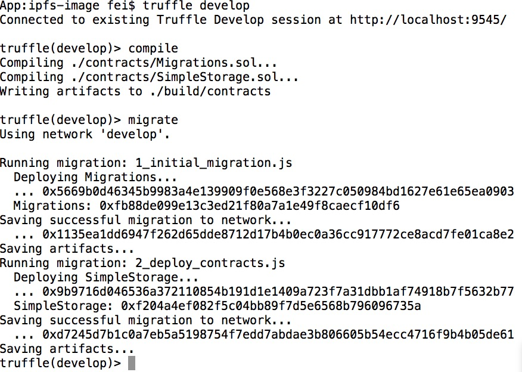
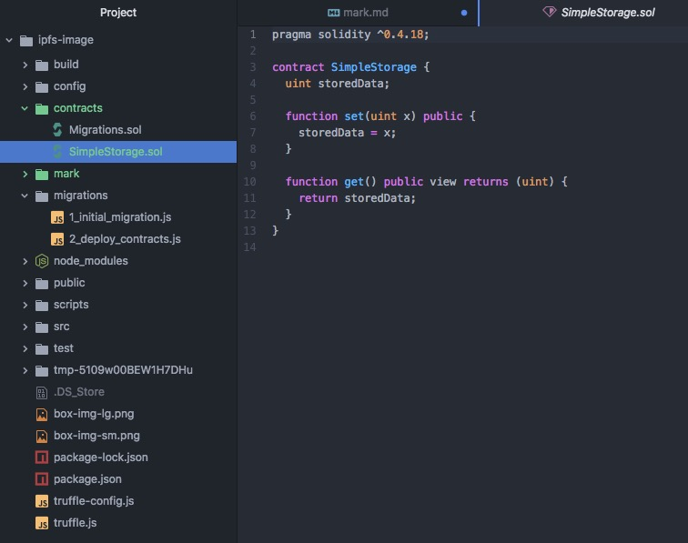
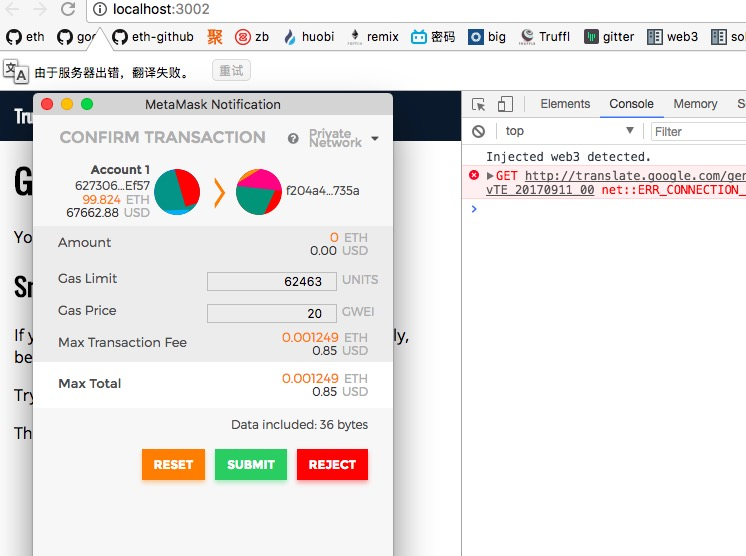
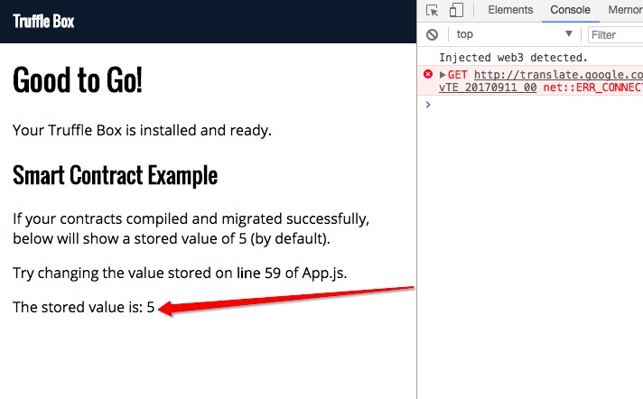
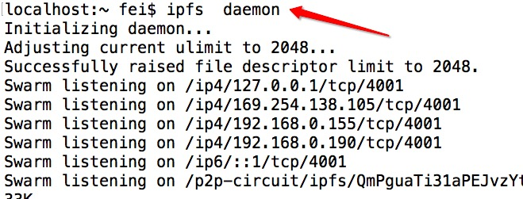
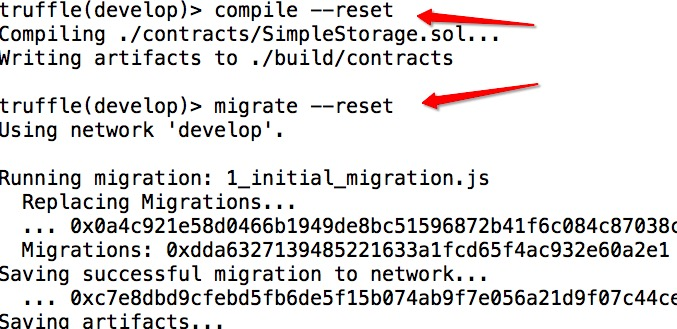
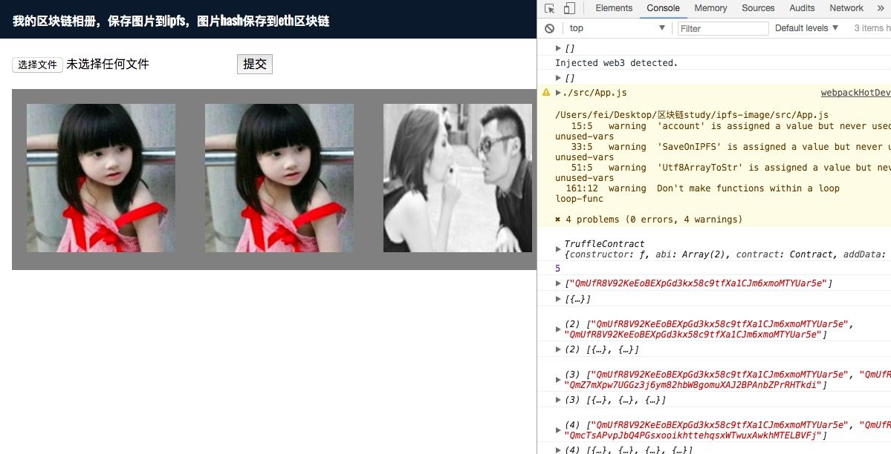

# ipfs 与react 与区块链结合的demo

# 第一步 前期的准备工作

- 在http://ipfs.io安装ipfs 配置好跨域


- 建立一个工作目录

```
mkdir ipfs-image

```
- 安装 react

```
truffle unbox react

```

-  npm 安装 ipfs-api

```
npm install --save-de ipfs-api

```
- 用 atom 打开当前目录

```
atom ./

```

- 打开另一个终端,输入 truffle develop 开启truffel终端编译合约

```
 compile
```
部署合约
```
migrate
```



- 当前的目录结构



# 前期的准备工作完毕 ,npm start 测试一下项目

```
 npm start

 ```

- 唤醒 metamask ,点击 submit
 

- 如果value 改为了5 ,说明前期成功部署结束




# 第二步,编写合约代码
```
pragma solidity ^0.4.18;

contract SimpleStorage {
  string [] storedData;

  function addData(string x) public {
    storedData.push(x);
  }

  function getData(uint i) public view returns (uint,string) {
    return (storedData.length,storedData[i]);
  }
}


```
# 第三部,编写/src/APP.js代码

```
import React, {Component} from 'react'
import SimpleStorageContract from '../build/contracts/SimpleStorage.json'
import getWeb3 from './utils/getWeb3'

import './css/oswald.css'
import './css/open-sans.css'
import './css/pure-min.css'
import './App.css'

//ipfs

import ipfsAPI from 'ipfs-api';
var ipfs = ipfsAPI('localhost', '5001', {protocol: 'http'});
var simpleStorageInstance
var account
var counts
let saveImageOnIpfs = (reader) => {
  return new Promise(function(resolve, reject) {
    const buffer = Buffer.from(reader.result);
    ipfs.add(buffer).then((response) => {
      console.log(response)

      resolve(response[0].hash);
    }).catch((err) => {
      console.error(err)

      reject(err);
    })

  })
}

let SaveOnIPFS = (text) => {
  return new Promise(function(reslove, reject) {
    //
    var str = Buffer.from(text, 'utf-8');
    console.log(str);
    if (str.length) {
      ipfs.add(str).then((response) => {
        reslove(response[0].hash);

      })
    } else {
      reject()
    }

  })

}

let Utf8ArrayToStr = (array) => {
  var out,
    i,
    len,
    c;
  var char2,
    char3;

  out = "";
  len = array.length;
  i = 0;
  while (i < len) {
    c = array[i++];
    switch (c >> 4) {
      case 0:
      case 1:
      case 2:
      case 3:
      case 4:
      case 5:
      case 6:
      case 7:
        // 0xxxxxxx
        out += String.fromCharCode(c);
        break;
      case 12:
      case 13:
        // 110x xxxx   10xx xxxx
        char2 = array[i++];
        out += String.fromCharCode(((c & 0x1F) << 6) | (char2 & 0x3F));
        break;
      case 14:
        // 1110 xxxx  10xx xxxx  10xx xxxx
        char2 = array[i++];
        char3 = array[i++];
        out += String.fromCharCode(((c & 0x0F) << 12) | ((char2 & 0x3F) << 6) | ((char3 & 0x3F) << 0));
        break;
      default:
        break;
    }
  }

  return out;
}

class App extends Component {
  constructor(props) {
    super(props)

    this.state = {

      storageValue: 0,
      web3: null,
      str: null,
      imgehashs: []
    }
  }

  componentWillMount() {
    // Get network provider and web3 instance.
    // See utils/getWeb3 for more info.

    getWeb3.then(results => {
      this.setState({web3: results.web3})

      // Instantiate contract once web3 provided.
      this.instantiateContract()
    }).catch(() => {
      console.log('Error finding web3.')
    })
  }

  instantiateContract() {
    /*
     * SMART CONTRACT EXAMPLE
     *
     * Normally these functions would be called in the context of a
     * state management library, but for convenience I've placed them here.
     */

    const contract = require('truffle-contract')
    const simpleStorage = contract(SimpleStorageContract)
    simpleStorage.setProvider(this.state.web3.currentProvider)

    // Declaring this for later so we can chain functions on SimpleStorage.

    // Get accounts.
    this.state.web3.eth.getAccounts((error, accounts) => {
      simpleStorage.deployed().then((instance) => {
        simpleStorageInstance = instance
        account = accounts[0];
        // Stores a given value, 5 by default.

        // return simpleStorageInstance.set(5, {from: accounts[0]})
        console.log(simpleStorageInstance);
      }).then((result) => {
        // Get the value from the contract to prove it worked.
        // return simpleStorageInstance.get.call(accounts[0])
        return simpleStorageInstance.getData(0, {from: accounts[0]})

      }).then((result) => {
        // Update state with the result.
        // return this.setState({storageValue: result.c[0]})
        console.log(result[0].c[0]);
        //有多个呀
        var count = result[0].c[0];
        var tempArray = this.state.imgehashs;
        var that = this

        for (var i = 1; i < count; i++) {
          (function(i) {
            simpleStorageInstance.getData(i, {from: accounts[0]}).then((result) => {
              tempArray.push(result[1]);
              console.log(tempArray);
              counts = i;
              that.setState({imgehashs: tempArray})
            })
          }(i))

        }

      })
    })
  }

  render() {
    var images = this.state.imgehashs.map((hash, index) => {
      return <div key={index} style={{backgroundColor: "gray",marginTop: 20}}>
        
      </div>
    })

    console.log(images);

    return (<div className="App">
      <nav className="navbar pure-menu pure-menu-horizontal">
        <a href="#" className="pure-menu-heading pure-menu-link">我的区块链相册 ,保存图片到ipfs,图片hash保存到eth区块链</a>
      </nav>

      <main className="container">
        <div className="pure-g">

          <div style={{marginTop: 30}}>
            <input ref="input_1" type="file" multiple="multiple"/>

            <button onClick={() => {
                var imgs = this.refs.input_1.files

                var reader = new FileReader();
                reader.readAsArrayBuffer(imgs[0])
                reader.onloadend = (e) => {
                  console.log("图片hash来了");
                  saveImageOnIpfs(reader).then(respon => {
                    console.log(respon);
                    //加载图片了
                    //把hash存到区块链
                    counts += 1
                    simpleStorageInstance.addData(respon, {from: this.state.web3.eth.accounts[0]}).then(() => {
                      simpleStorageInstance.getData(counts).then((result) => {
                        console.log("区块链");
                        console.log(result);
                        var tempArray = this.state.imgehashs;
                        tempArray.push(result[1]);
                        this.setState({imgehash: tempArray})

                      })

                    })

                  })
                }

              }}>提交</button>

            <div id="imges" style={{
                display: "flex",
                flexDirection: 'row'
              }}>
              {images}
            </div>

          </div>

        </div>
      </main>
    </div>);
  }
}
export default App;


```

# 第四步 启动ipfs,重新编译,部署



- 重新编译,部署



# 选择文件,点击提交 ,测试


# 不懂练联系我weChat: chen1048258


